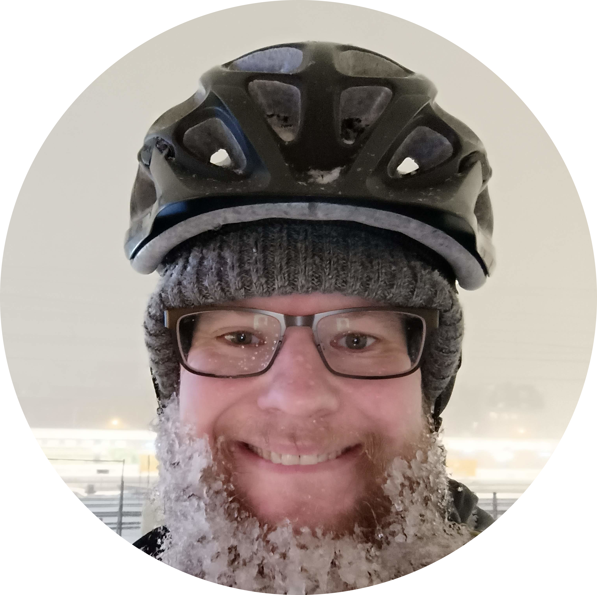

## Kalle Tolonen (Turku, Finland)

+358 44 330 9928 | kalle.tolonen@gmail.com | [linkedin.com/in/kalletolonen](https://www.linkedin.com/in/kalletolonen) | [kalletolonen.com](https://www.kalletolonen.com)

## Summary
Fullstack developer focused on GIS systems. At Sitowise since 2022: customer GIS/asset platforms (Java/Angular legacy with 3000+ users and 10+ integrations; Azure Dotnet/React), PostgreSQL/PostGIS, and coaching GIS professionals. Ships side products (Muksukartta, maritime AIS) and applied AI features — not as a research role. Turku.

---

## Experience

**Sitowise - Fullstack Developer & Coach · GIS**   
September 2022 - Present (Turku, Finland)  
- Software development for SAFe customer projects (GIS and asset management). Project example 1: Fullstack Java/Angular for a lecagy project used by 3000+ users and 10+ integrating systems. Project example 2: Fullstack for a Azure project written in Dotnet & React. Coaching a team of GIS professionals alongside development duties.

**Koutsi-Softa Oy Ab - Founder**   
June 2024 - October 2025 (Turku, Finland)  
- Scalable platform for client management to personal trainers and their clients. Fullstack development and DevOps for a SaaS product targeting fitness professionals.

**Blake Consulting - Self-employed**   
January 2020 - Present (Finland)   
- Managing 6 event restaurants with 100+ staff simultaneously, overseeing budgeting, permitting, and execution while achieving top customer satisfaction ratings. 

**Prime Minister\'s Office - Service Coordinator**   
January 2019 - January 2020 (Helsinki, Finland)   
- Led coordination of high-profile events during Finland\'s EU presidency, managing staff, security, and contractors to deliver seamless, high-quality service. 

---

## Projects

- Muksukartta (2026) — Finnish kids POI reachability PWA: isochrone/travel-time maps, React + Leaflet, public data; applied product AI for event parsing. Live: https://muksukartta.com

---

## Education

**Turku University of Applied Sciences — YAMK, Data Engineering and AI (thesis 2026; degree in progress)**

**Haaga-Helia University of Applied Sciences - BBA in Information Tech** — Helsinki, Finland  
2023  
- Software development & digital services, GPA: 4.53/5.0  

**Haaga-Helia University of Applied Sciences - BBA in Hospitality Management** — Helsinki, Finland  
2018  

---

## Skills & Tech
* Agile Methodologies: SAFe, Scrum, AI-first SW-development
* People Skills: Leadership, Collaboration, & Project Management
* Languages: Java, JavaScript, Python, Go, SQL, C#, Rust
* Frameworks: Spring, Angular, Django, NestJS, React & React Native
* Tools: Docker, Git, Maven, Jenkins, GitHub Actions, Robot Framework, Azure
* Databases: PostgreSQL / PostGIS, SQLite
* Systems: Linux, MacOS, Windows, GIS, Apache/Nginx
 
